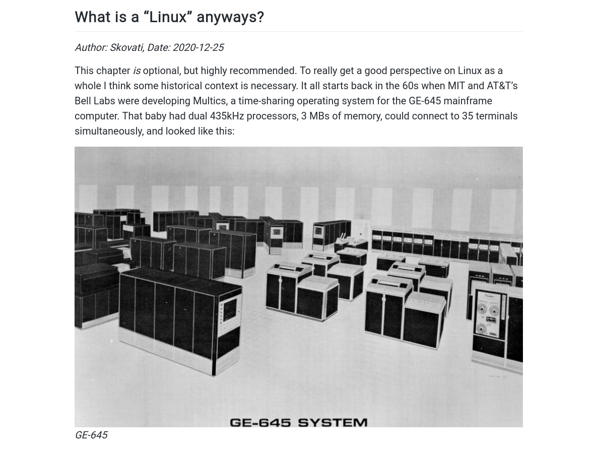

### Skovati's Blog

Personal blog where I talk about Linux, programming, philosophy and more. Live at [blog.skovati.com](https://blog.skovati.com)

Written in [Markdown](https://en.wikipedia.org/wiki/Markdown), compiled with [Pandoc](https://pandoc.org/), and served by [Nginx](https://www.nginx.com/) on [Debian GNU/Linux](https://www.debian.org/). Source code available [here](https://github.com/skovati/skovati.com/tree/master/blog).

